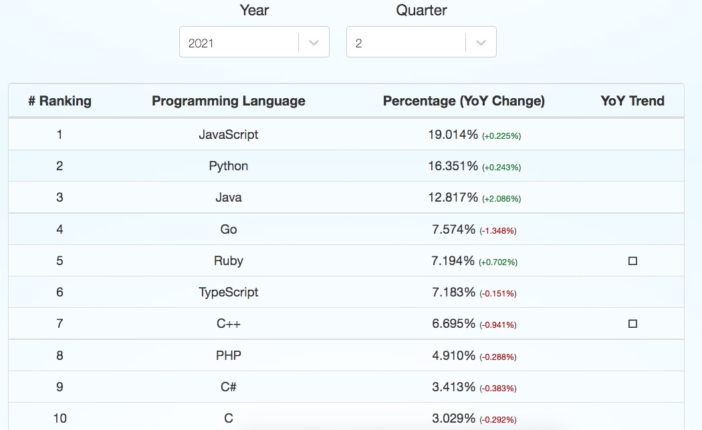

# Nhập môn Golang

## 1. Hãy đảm bảo bạn đã cài Golang và công cụ lập trình

Mở terminal kiểm tra bằng cách gõ lệnh sau đây
```
$ go version
go version go1.16.6 darwin/amd64
```
Phiên bản mới nhất Go hiện nay là 1.17. Bạn có thể vào trang [https://go.dev/](https://go.dev/)

```
$ echo $GOPATH
/Users/techmaster/golang

$ echo $GOROOT
/usr/local/Cellar/go/1.16.6/libexec
```

Hỏi: `$GOPATH` khác gì `$GOROOT`

Đáp: `$GOROOT` lưu các thư viện, file chạy quan trọng nhất để chạy, biên dịch file *.go. Còn `$GOPATH` là nơi để lưu các thư viện bổ xung mà lập trình cài thêm trong lúc lập trình

Kiểm tra xem file biên dịch go nằm ở thư mục nào
```
$ which go
/usr/local/bin/go
```
Thực chất file này chỉ là symbolic link đến
```
$ ls -l `which go`
lrwxr-xr-x  1 techmaster  admin  26 Jul 22 15:48 /usr/local/bin/go -> ../Cellar/go/1.16.6/bin/go
```

## 2. Cảm nhận một người code nhiều năm Java khi chuyển sang Golang là gì?

> Nếu như Java là một ông anh chững chạc, đĩnh đạc ở tuổi 37, có chung cư nhà, xe hơi và gia đình. Thì Go là anh chàng 23 tuổi, cởi mở, xử lý vấn đề nhanh, chất mọi thứ lên mobihome để di chuyển từ thành phố này sang thành phố khác. Khi cần có thể đi bộ, đi xe đạp.

 |               | Java              | Go              |
 |---------------|-------------------|-----------------|
 |Ra đời         | 1995              | 2009            |
 |Phổ biến       | thứ 3             | thứ 4           |
 |OOP            | Xuất sắc          | Hỗ trợ tối giản |
 |Data Structure | Cực đa dạng       | Array, Slice, Map, Struct|
 |



Cảm nhận tháng đầu tiên code Golang: trời sao thiếu nhiều thứ vậy, cái gì cũng không có là sao?

Cảm nhận tháng thứ 2 code Golang: hoá ra chỉ với ngần đó, mọi thứ vẫn ổn và đủ dùng, hợp lý.

Cảm nhận tháng thứ 3 code Golang: tại sao không chuyển tất cả code Java sang Golang nhỉ?

## 3. Show me your code

### 3.1 Hello World
```go
package main

import "fmt"

func main() {
	fmt.Println("Hello World")
}
```
Vào terminal gõ 
```
$ go run main.go
Hello World
```

### 3.2 Đọc từ bàn phím
```go
package main

import (
	"bufio"
	"fmt"
	"os"
)

func main() {
	reader := bufio.NewReader(os.Stdin)
	fmt.Print("Enter your city: ")
	city, _ := reader.ReadString('\n')
	fmt.Print("You live in " + city)
}
```

Chạy thử
```
$ go run main.go
Enter your city: Hanoi
You live in Hanoi
```

### 3.3 Khai báo biến
Ví dụ tính chỉ số BMI
```go
package main

import (
	"fmt"
)

func main() {
	height := 1.76
	weight := 72.0
	bmi := CaclulteBMI(height, weight)
	fmt.Println("Chỉ số bmi của bạn = ", bmi)

}

func CalculateBMI(height float64, weight float64) (index float64) {
	return weight / (height * height)
}
```

### 3.3 Cải tiến ví dụ trước cho phép đọc vào từ bàn phím
```go
package main

import (
	"bufio"
	"fmt"
	"os"
	"strconv"
)

func main() {
	var (
		err    error
		height float64
		weight float64
	)
	reader := bufio.NewReader(os.Stdin)
	fmt.Print("Chiều cao của bạn :")
	str, _ := reader.ReadString('\n')

	if height, err = strconv.ParseFloat(str, 64); err != nil {
		fmt.Println(err.Error())
		return
	}

	fmt.Print("Cân nặng của bạn :")
	str, _ = reader.ReadString('\n')
	if weight, err = strconv.ParseFloat(str, 64); err != nil {
		fmt.Println(err.Error())
		return
	}
	bmi := CalculateBMI(height, weight)
	fmt.Println("Chỉ số bmi của bạn = ", bmi)

}

func CalculateBMI(height float64, weight float64) (index float64) {
	return weight / (height * height)
}
```

Thật không may chạy thử thì lỗi
```
$ go run main.go
Chiều cao của bạn :1.7
strconv.ParseFloat: parsing "1.7\n": invalid syntax
```

**Nhiệm vụ của bạn hãy tìm hàm để sửa lỗi này**
Gợi ý hãy dùng hàm `strings.Trim***`

### 3.4 Hãy refactor lại đoạn code trên
Việc nhập vào chiều cao, cân nặng bản chất là giống nhau.
Hãy viết hàm để tái sử dụng code nhập dữ liệu.

### 3.5 Đánh giá chỉ số BMI bằng lệnh switch
```go
package main

import "fmt"

func main() {
	testBMIs := []float64{14, 16, 16.5, 18, 23, 27, 32, 40, 42}

	for _, bmi := range testBMIs {
		fmt.Println(ReviewBMI(bmi))
	}
}

func ReviewBMI(bmi float64) string {
	switch {
	case bmi < 16:
		return "Severe thinness"
	case bmi < 16.9:
		return "Moderate thinness"
	case bmi < 18.4:
		return "Mild thinness"
	case bmi < 24.9:
		return "Normal"
	case bmi < 29.9:
		return "Pre-obese"
	case bmi < 34.9:
		return "Obese (Class I)"
	case bmi < 39.9:
		return "Obese (Class II)"
	default:
		return "Obese (Class III)"
	}
}
```

Chạy thử
```
$ go run main.go
Severe thinness
Moderate thinness
Moderate thinness
Mild thinness
Normal
Pre-obese
Obese (Class I)
Obese (Class III)
Obese (Class III)
```


### 3.6 Dạng switch dạng tập hợp

```go
package main

import "fmt"

func main() {
	months := []string{"Jan", "Feb", "Mar", "Apr", "May", "Jun", "Jul", "Aug", "Sep", "Oct", "Nov", "Dec"}
	for i, month := range months {
		fmt.Printf("%d - %s - %s\n", i+1, month, quarterInYear(month))
	}
}

func quarterInYear(month string) string {
	switch month {
	case "Jan", "Feb", "Mar":
		return "1st quarter"
	case "Apr", "May", "Jun":
		return "2nd quarter"
	case "Jul", "Aug", "Sep":
		return "3rd quarter"
	default:
		return "4th quarter"
	}
}
```

### 3.7 Đệ quy
```go
func factorial(n int) int {
	if n == 1 {
		return 1
	}
	return n * factorial(n-1)
}
```

**Bài tập**
Hãy viết hàm tính chuỗi Fibonacii

### 3.8 Hàm có tham số tuỳ biến variadic function
Xem ví dụ ở [md/main.go](md/ReadMe.md)
```go
func createMarkDown(fileName ...string) {
	var filename string
	if len(fileName) == 0 {
		filename = "ReadMe.md"
	} else {
		filename = fileName[0]
	}
}
```
### 3.9 Khai  báo  struct
Xem [structs/main.go](structs/main.go)

```go
package main

import "fmt"

type Person struct {
	Id       string
	FullName string
	Email    string
}


func (p Person) String() string {
	return fmt.Sprintf("%s : %s : %s", p.Id, p.FullName, p.Email)
}

func main() {
	type personRequest struct {
		FullName string
		Email    string
	}

	pRequest := personRequest{
		FullName: "Trinh Minh Cuong",
		Email:    "cuong@techmaster.vn",
	}

	person := Person{
		Id:       "ox-13",
		FullName: pRequest.FullName,
		Email:    pRequest.Email,
	}
	fmt.Println(person)
}
```

Hỏi: Nếu không có hàm này, kết quả in ra thế nào?

```go
func (p Person) String() string {
	return fmt.Sprintf("%s : %s : %s", p.Id, p.FullName, p.Email)
}
```

Hỏi : Khác biệt giữa hai hàm dưới đây là gì?
```go
func (p Person) String() string {
	return fmt.Sprintf("%s : %s : %s", p.Id, p.FullName, p.Email)
}
```
và
```go

func (p *Person) String() string {
	return fmt.Sprintf("%s : %s : %s", p.Id, p.FullName, p.Email)
}
```

### 3.10 Composite struct
Xem 
```go
type Address struct {
	Location string
	City     string
	Country  string
}
type Person struct {
	Id       string
	FullName string
	Email    string
	Addr     Address  //Chứa address
}
```
## 4. Bài tập lập trình

### 4.1 Kiểm tra 3 cạnh tam giác
Nhập vào 3 số bất kỳ a, b, c hãy kiểm tra xem 3 số này có tạo thành cạnh tam giác

### 4.2 Giải phương trình bậc 2
Nhập vào ba số `a, b, c` kiểu `float64` hãy giải phương trình bậc 2.
Đặc biệt khi Delta < 0 thì trả về kết quả là [số phức](https://vi.wikipedia.org/wiki/S%E1%BB%91_ph%E1%BB%A9c).

### 4.2 Đoán số
Máy tính tự sinh ra một số nguyên dương X >= 0 và <= 100.
Lập trình một vòng lặp để người dùng đoán số.
- Nếu số đoán lớn hơn X thì in ra "Số bạn đoán lớn hơn X"
- Nếu số đoán nhỏ hơn X thì in ra "Số bạn đoán nhỏ hơn X"
- Nếu bằng X thì in ra "Bạn đã đoán đúng"


### 4.3 Lập dãy số nguyên tố
Nhập vào số nguyên dương N < 100,000 hãy trả về mảng các số nguyên tố.
Gợi ý: [hãy học slice](https://tour.golang.org/moretypes/7)