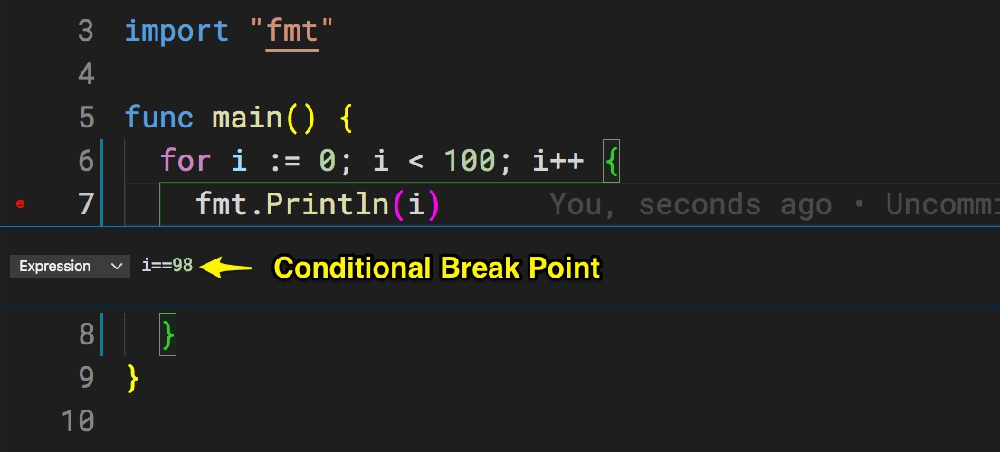

# Lecture Notes:

## 1. package - module
package main chứa func main là điểm bắt đầu chạy chương trình go.

- Một ứng dụng Go (module go) có thể chứa nhiều package.
- Mỗi package nằm ở một thư mục khác nhau.
- Trong một package có thể chứa 1-nhiều file go. Mỗi file go hãy giữ dưới 200 dòng.
- Một ứng dụng Go có thể import nhiều module ngoài. Tương tự mỗi module ngoài có thể chứa 1-nhiều package

## 2. Hàm trả về error
Do Go không có try/catch nên các bạn luôn phải kiểm tra lỗi trả về từ mỗi func.

Quy ước tham số trả về cuối cùng luôn là error

Golang có cú pháp đặc biệt gọi là if assignment gồm 2 vế:
1. Assignment: `result, err := Sqrt(-1)`
2. Condition: `err != nil`
  
Ví dụ:
```go
if result, err := Sqrt(-1); err != nil {
	fmt.Println(err.Error())
} else {
	fmt.Println(result)
}
```

> Kinh nghiệm sương máu: đừng cố lờ đi lỗi trả về. Sau này rất khó dò lỗi.
Đã có lỗi thì phải kiểm tra và xử lý

## 3. Debug trong Go và VSCode

Để debug được ứng dụng Golang chúng ta cần phải:
1. Tạo go module `go mod init ten_module`
2. Trong VSCode "Create launch JSON file"

Hãy tận dụng tối đa chức năng debug, đừng chỉ dùng lệnh in ra console.

Sau khi triển khai ứng dụng lên production. Hãy xoá hết tất cả các lệnh debug in ra console, vì những lệnh này gây chậm tốc độ.

```go
fmt.Println(variable)
```

Trong debug tool bar của VSCode có mấy nút:
1. Continue: chạy tiếp
2. Step Over: chạy qua đến dòng lệnh tiếp theo
3. Step Into: đi sâu vào lệnh hiện tại vào hàm được gọi
4. Step Out: chạy ra ngoài hàm hiện tại
5. Restart: khởi động lại ứng dụng

Cần chú ý khung debug
1. Variables gồm 2 phần: Arguments (tham số truyền vào), Locals (các biến cục bộ trong hàm đang được debug)
2. Watch: lập trình viên có thể thêm các biểu thức để quan sát
3. BreakPoints: các điểm dừng do lập trình đặt để dừng chương trình
4. Call Stack: ngăn xếp các hàm chồng lên nhau khi chạy debug


Condition BreakPoint hữu ích khi chúng ta phải debug một vòng lặp rất nhiều lần. Hãy viết biểu thức boolean để tạm ngưng vòng lặp ở điểm chúng ta cần debug.


## 4. Khai báo mảng
Có 3 cách. Tôi chọn cách ngắn nhất
```go
cars := [3]string{"Toyota", "Mercedes", "BMW"}
cars := []string{"Toyota", "Mercedes", "BMW"}
cars := [...]string{"Toyota", "Mercedes", "BMW"}
```
Hai cách khai báo mảng 2 chiều

Không xác định số lượng phần tử trong mảng con
```go
langs := [][]string{{"C#", "C", "Python"},
		{"Java", "Scala", "Perl"},
		{"C++", "Go", "RUST", "Crystal", "OCAML"}}
```

Xác định số lượng phần tử trong mảng con là 3 ! Kiểm tra lúc compile time.
```go
langs := [][3]string{{"C#", "C", "Python"},
		{"Java", "Scala", "Perl"},
		{"C++", "Go", "RUST"}}
```

## 5. defer
Đưa một lệnh vào một ngăn xếp đặc biệt. Trước khi hàm thoát, thì sẽ thực hiện tuần tự các lệnh trong ngăn xếp này theo cơ chế Last In First Out

Xem ví dụ:
```go
func reverseLoop() {
	cars := [3]string{"Toyota", "Mercedes", "BMW"}
	//fmt.Println(cars[0]) // Toyota
	for index, car := range cars {
		defer fmt.Println(index, car)
	}
}
```

Hàm reverse dùng defer này không tối ưu về tốc độ, tốn bộ nhớ

## 6. slice vs array

array trong Go là static array. Số phần tử mảng không thay đổi sau khi khởi tạo.
Muốn thay đổi phần tử, thêm, xoá phải dùng slice.
Phần tử trong mảng array có thể là value có thể là reference (con trỏ đến vùng nhớ) tuỳ thuộc vào kiểm phần tử mảng.

Chỉ mục truy xuất đến phần tử mảng luôn bắt đầu từ 0. Zero base tương tự như C, C++, Java

> Chú ý chỉ số sau ký tự `:` là exclusive chứ không phải là inclusive, có nghĩa là không bao gồm.
```go
fmt.Println(a[:2])        //Lấy 2 phần tử đầu tiên
fmt.Println(a[2:])        //Bỏ qua 2 phần tử đầu tiên
fmt.Println(a[len(a)-2:]) //Lấy 2 phần tử cuối cùng
fmt.Println(a[1:3])
```

## 7. map kiểu lưu trữ key-value

Khai báo map sử dụng từ khoá `make` rất dài dòng
```go
dict := make(map[string]string)
```

Khai báo ngắn gọn. Recommended !
```go
dict := map[string]string{}
```

## 8. Remove item from slice
Có nhiều cách để xoá phần tử ra khỏi slice, chia thành 2 nhóm:

1. Ưu tiên tốc độ, không quan tâm đến thứ tự phần tử sau khi xoá
2. Ưu tiên giữ thứ tự phần tử

Cần có phương pháp đánh giá tốc độ các phương pháp này. Golang cung cấp kỹ thuật Benchmark

## 8. Test và Benchmark

Golang cung cấp 2 kỹ thuật:
1. Unit Test kiểm thử logic chạy có theo ý đồ của lập trình viên không
2. Benchmark kiểm thử tốc độ thực thi

Chúng ta có thể viết file *test.go nằm trong cùng package hoặc ra thư mục riêng.
Xem [remove_slice_bench_test.go](remove_slice_bench_test.go)

File test hay benchmark luôn phải kết thúc bằng `test.go` và `import "testing"`

Hàm benchmark luôn phải bắt đầu bằng `func Benchmark`

Hãy liên tục viết hàm benchmark để chọn ra cách tối ưu thực thi. Phong cách của Go là
- Đơn giản
- Ngắn gọn
- Chạy nhanh
- Tốn ít RAM

## 9. Truyền slice vào một hàm

Khi truyền vào một mảng/slice là truyền by reference

Khi một slice truyền vào một hàm, mặc dù nhìn có vẻ như là truyền bằng giá trị, nhưng thực chất là truyền bằng con trỏ
tham chiếu đến cùng một mảng (array). Bất kỳ thay đổi nào lên slice cũng sẽ ảnh hưởng trực tiếp để mảng.

**Qua đây chúng ta thấy quan hệ giữa mảng (array) và slice như sau:**

- Mảng là nơi lưu trữ các phần tử thực sự trong bộ nhớ.
- Còn slice là cấu trúc để tham chiếu đến các phần tử mảng này.
- Mảng thì tĩnh, không thể thay đổi kích thước. Nhưng với slice thì có thể thêm, bớt, nghịch đảo phần tử.

## 10. Khai báo mảng sử dụng anonymous struct
Cách này vừa khai báo mảng chứa các struct. Không cần ghi rõ tên struct mà chỉ cần các thuộc tính bên trong struct. Sau khi khai báo xong, thì khởi tạo dữ liệu luôn

Xem xem `sortSliceWithFunc()` trong [sort.go](sort.go)
```go
people := []struct {
		Name string
		Age  int
	}{
		{"Gopher", 7},
		{"Alice", 55},
		{"Vera", 24},
		{"Bob", 75},
	}
```

# Struct

Golang không có class mà chỉ có Struct

- Struct không có tính kế thừa.
- Composition over Inheritance
- Struct Golang có method nhưng chúng ta không viết method bên trong Struct như khai báo Class trong Java

Pointer receiver có thể thay đổi thuộc tính của struct khi kết thúc phương thức

Value receiver thay đổi thuộc tính bên trong phương thức thì được, thì kết thúc phương thức thì giá trị ban đầu của struct giữ nguyên.

Tại sao?
Pointer receiver làm việc trực tiếp trên đối tượng
Value receiver làm việc với bản copy của đối tượng

Khi dùng lệnh in địa chỉ sẽ thấy Pointer receiver dùng đối tượng trùng với đối tượng truyền vào, còn Value receiver dùng đối tượng khác địa chỉ
```go
fmt.Printf("pointer receiver %p\n", p)
```

Có thể khai báo Struct chưa bao nhiêu Struct khác tuỳ ý. Đây là Composition

```go
type Person struct {
	FirstName string //kiểu đứng sau tên biến
	LastName  string
	Age       int
	Address1  Address
	Address2  Address
}

type Address struct {
	Country string
	City    string
}
```

Khởi tạo 
```go
person := Person{"Trinh", "Cuong", 45,
		Address{"Vietnam", "Hanoi"},
		Address{"USA", "California"}}
```

Khả năng thứ 2:
```go
type Person struct {
	FirstName string //kiểu đứng sau tên biến
	LastName  string
	Age       int
	Address1  Address  //value
	Address2  *Address //pointer
}
```

```go
person := Person{"Trinh", "Cuong", 45,
		Address{"Vietnam", "Hanoi"},
		&Address{"USA", "California"}}  //Lấy địa chỉ của đối tượng Address{"USA", "California"}
```