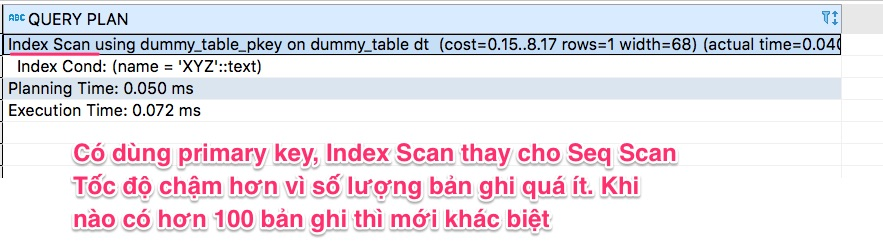

# Hướng dẫn lập trình Go-pg + Postgresql 14

## 1. Tạo dự án và các thư mục package
```
├── ddl -> chứa các lệnh DDL tạo bảng
├── model -> chứa định nghĩa các entity trong Golang
├── query -> chứa các file markdown ghi chú các câu lệnh Query phức tạp`
├── repo -> chứa các hàm thao tác dữ liệu
├── test -> viết các hàmg unit test kiểm tra lại repo
├── go.mod
└── ReadMe.md -> document những phần quan trọng
```

## 2. Quy trình thiết kế ứng dụng có CSDL quan hệ

Các web framework nếu chỉ phục vụ REST thực ra rất dễ. Có thể 3-4 framework trong một buổi vì chúng tương đồng như nhau. Nắm vững một web framework có thể chuyển sang web framework khác.

80% việc xử lý request và trả về response là tương tác với CSDL.
Khi làm việc với CSDL thường mọi người nghĩ có mấy dạng căn bản:
- Quan hệ 1-1
- Quan hệ 1-nhiều
- Quan hệ nhiều-nhiều
- Quan hệ nhiều-nhiều bảng trung giang bổ xung cột
- Quan hệ recursive relationship

Quy trình thiết kế CSDL gồm có các bước:
1. Lấy yêu cầu. Cần đặt những câu hỏi: 
   - Who (ai tham gia quy trình, vai trò, hoặc được thụ hưởng, hay bị tác động như thế nào?)
   - What (cái gì, đối tượng nào: đơn hàng hàng, một lần chuyển khoản, một yêu cầu xử lý sự cố, lịch học...)
   - When (khi nào flow sẽ bắt đầu. Việc tính lương sẽ bắt đầu ngày cuối cùng của tháng...)
   - How Often (tần suất)
   - Why (tại sao, đánh giá có nên implement chức năng này không)
   - How (thực hiện như thế nào? để gửi thông báo: email, SMS, push notification. 
   Xuất ra báo cáo: HTML, PDF, Excel, Google Doc, Google Sheet, JSON, CSV...)
   - How Many (số lượng truy cập đồng thời, phải xử lý bao nhiêu đơn hàng trong một ngày.... dùng để dự trù và dự toán tài nguyên cũng như chuẩn bị công nghệ phù hợp để phục vụ)
   - Không đặt nhưng câu hỏi để khách hàng trả về những thông tin cảm tính, chung chung. Mọi thứ cần định lượng, đo đếm rõ ràng.

2. Document lại tất cả các yêu cầu. Cần phải viết rất dễ hiểu, ngắn gọn và tránh dùng những tính từ không rõ định lượng.
   - Thay vì viết như thế này "Yêu cầu trang web phải đẹp, tính thẩm mỹ cao"
   - Hãy viết "trang phải hỗ trợ xem được trên Desktop 1366x768, FullHD và các smartphone từ năm 2011 trở lại đây. Màu sắc chủ đạo là xanh da trời + trắng. Thời gian load trang chủ lần đần tiên phải dưới 1 giây."
   - Thay vì "Hệ thống phải xử lý đơn hàng cực nhanh" hãy viết là "Hệ thống phải xử lý được tối thiểu 10 đơn hàng trong một phút, tối đa là 50 đơn hàng trong một phút".
   - Thay vì viết rất là dài dòng, hãy sử dụng nhiều diagram để giúp khách hàng cũng như các lập trình khác trong team có thể hiểu nhanh. Viết tài liệu không phải để khoe năng lực, trình độ uyên thâm bằng các câu từ cao siêu, mà viết tài liệu cần dễ hiểu, xúc tích, dễ nhớ. Một hình ảnh tốt hơn cả 1000 lời nói.

3. Thiết kế tổng thể - Top Down. Bottom Up dùng khi gia công phần mềm chỉ làm một module nhỏ, bảo trì hệ thống có sẵn...Bottom Up cũng rất hữu ích để lập trình viên thử nghiệm các kỹ thuật nhỏ, để verify, kiểm tra tính khả thi trước khi ghép vào thành một hệ thống lớn.

**Chúng ta không thể thiết Top Down tốt nếu không thực hành Bottom Up liên tục.**

Cần liên tục cập nhật bổ xung, lấy ý kiến của các bên liên quan trong quá trình phát triển phần mềm.

4. Áp lực phải ra sản phẩm ngay hôm nay rất quyết liệt. Chúng ta không thể máy móc dùng Waterfall hay các phương pháp quản lý dự án cũ. Gợi ý SCRUM, Agile.
Muốn ra được sản phẩm nhanh, thích ứng với thị trường:
- Mỗi người trong team phải là Problem Solver
- Mỗi người trong team cũng phải một người chia sẻ tích cực

5. Thiết kế - lập trình CSDL như thế nào?
> MySQL - Sakila có sẵn cấu trúc bảng, có sẵn data, có sẵn diagram.
Sinh viên chỉ viết câu lệnh SQL. Sau này vào dự án không làm được vì không biết phân tích thiết kế, không chuyển được yêu cầu khách hàng sang các bảng.

Kết hợp Top Down và Bottom Up:

- Top Down:
  - Liệt kê bảng tương ưng với Entity. Who-What giúp hình dùng Entity.
  - How many, how much -> quan hệ giữa các entity: 1-M, M-M..
  - How often, how long -> time series
  - Xác định primary key dùng để xác định, tìm kiếm đối tượng đúng.
  - Hiện nay có 2 phương pháp chính để tạo giá trị cho primary key:
    - Ví dụ id CMND, email, số di động - naturally primary key
    - Với những đối tượng không có sẵn natural primary key. Có ít nhất cách: database chủ động sinh primary key hoặc là client sinh primary key.
    - Kiểu dữ liệu primary key: số nguyên dương tự động tăng hoặc là string.
    - Ưu điểm dùng integer tự tăng làm primary key: tốn ít dung lượng, có sẵn tính sắp xếp tốt hơn so với so sánh string hay datetime. Nhược điểm của integer tự tăng dễ bị xung đột giá trị khi scaleout database.
    - Ưu điểm dùng unique id dạng string: yêu cầu tính duy nhất ở một không gian lớn (toàn bộ hệ thống, trên toàn bộ các địa điểm, trên toàn cầu). Nhược điểm tốn dung lượng. Có vài loại: loại xịn nhất: vừa globally unique và sắp xếp được theo thời điểm tạo ra. loại bình dân: glolablly unique. Có thể kết hợp cộng số tự tăng + globally unique id.


**Khi thiết kế Top Down quá lâu sẽ bị chủ quan duy ý trí. Thiết kế xong, không code được hoặc code rất khó !**

Vừa thiết kế Top Down mà cần phải lập trình Bottom Up để kiểm thử mô hình thiết kế.

6. Lập trình thử nghiệm verify thiết kế (Bottom Up)
- Không cần sử dụng các web framework gì hết.
- Làm theo các bước sau: 
    1. Viết lệnh DDL script tạo bảng và quan hệ lưu vào thư mục `ddl`
    2. Định nghĩa các model (entity) bằng Go lưu vào thư mục `model` dùng để map dữ liệu từ Table vào Object
    3. Viết các hàm trong repo viết Go. Phân rõ hàm Public và private. Hãy dùng snake_case để tên hàm dễ đọc. `Create_films_books() (err error)` luôn phải trả về `err error` để xử lý lỗi
    4. Viết unit test để chạy các hàm trong repo.

**Measure twice cut once**

> Ví dụ : xây dựng một sàn bán chung cư. Cần dự tính VN mỗi một năm có bao nhiều nghìn chưng cư xây mới. Số lượng bản ghi thêm mới mỗi tháng, mỗi năm.
Hãy dùng unit test kết hợp với repo để sinh ra bộ dữ liệu đủ lớn như thật.
Tuyệt đối không dùng web framework để nhập dữ liệu cò con. Lớn rồi tư duy phải khác đi.

## Thực hành

Khởi tạo một Docker container Postgresql 14
```
docker run --name postgres14 -e POSTGRES_PASSWORD=123 -p 5432:5432 -d postgres:14.0-alpine
```
```sql
create table dummy_table(name varchar(20),address text,age int);
insert into dummy_table values('XYZ','location-A',25);
insert into dummy_table values('ABC','location-B',35);
insert into dummy_table values('DEF','location-C',40);
insert into dummy_table values('PQR','location-D',54);
```


Không dùng primary key, khi tìm kiếm sẽ phải dùng đến Sequential Scan


Nên đổi 
```sql
create table dummy_table(name varchar(20),address text,age int);
```
thành 
```sql
create table dummy_table(name text primary key,address text,age int);
```

Dùng primary key, khi tìm kiếm sẽ dùng Index Scan. Thực sự hiệu suất khi số lượng bản ghi lớn


## Bài tập về nhà:

1. Thực hành tất cả [những lệnh SQL trong bài viết này](https://techmaster.vn/posts/36773/gioi-thieu-cac-cau-truy-van-trong-postgesql-qua-cac-vi-du)
2. Làm quen với [thao tác JSON trong Postgresql](https://techmaster.vn/posts/36775/thao-tac-json-trong-postgresql)

## Buổi sau chúng ta sẽ thực hành với Go PG và có nhiều bài tập thiết kế thực tế

