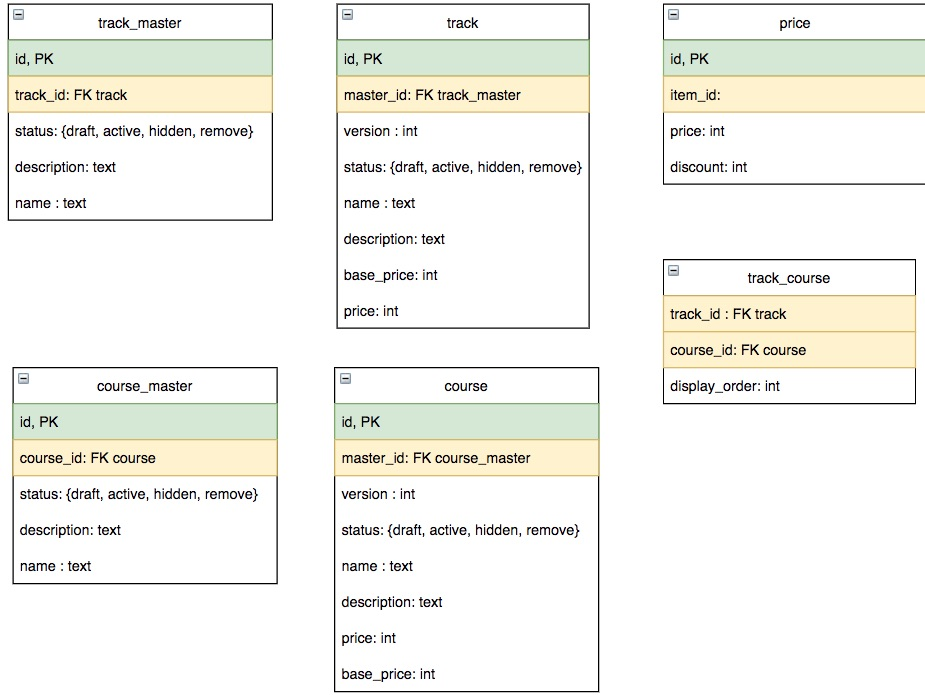

# Lộ trình (track) và khoá học (course)

## Giới thiệu
Trong buổi học này, các bạn sẽ thực hành với một ví dụ thực tế như sau. Nhiệm vụ của chúng ta biến những tập luật dài loằng ngoằng này thành code chạy được, có kiểm thử !

Techmaster là một trung tâm đào tạo CNTT. Techmaster cung cấp những khoá học ngắn hạn dưới 30 buổi gọi là `course` và cả những lộ trình đào tạo dài hạn 4-9 tháng gồm nhiều khoá học ghép lại gọi là `track`.

## Nghiệp vụ
- Một track (lộ trình) gồm nhiều course (khoá học)
- Một khoá học có thể dạy trong vài lộ trình khác nhau. 
- Techmaster bán công khai cả track và course. Cần có cơ chế quản lý lịch sử giá, chế độ khuyến mại của track và course
- Mỗi course được dạy trong một số buổi học là N. Học phí dự tính sẽ là N * 250,000 VND. Nhân viên sales Techmaster có thể điều chỉnh giá của course. Mỗi lần điều chỉnh giá cần phải lưu lại lịch sử.
- Một track gồm nhiều course. Vậy số buổi của track = tổng số buổi của các khoá học cộng lại.
- Học phí dự tính của track sẽ bằng tổng học phí dự tính của course * 0.95. Có nghĩa là giảm 5% so với việc sinh viên đăng ký từng khoá riêng rẽ. Nhân viên sales có thể điều chỉnh giá của track trên cơ sở học phí dự tính.
- Thứ tự học của các course trong track rất quan trọng. Khoá học dễ, căn bản phải học trước.
- Sinh viên học track có thể cùng một lúc học nhiều course song song thường là 2.
- Nhân viên Techmaster có thể thay đổi thứ tự course trong track.
- Chương trình khuyến mại của Techmaster sẽ giảm giá theo phần trăm (percentage %) trên học phí hoặc giảm số tiền cụ thể (amount) trên học phí.
- Làm sao thiết kế hệ thống để Techmaster bây giờ bán track, course, nhưng trong tương lai có thể bán các dịch vụ sản phẩm khác mà chức năng bán hàng trực tuyến không phải thay đổi, code lại quá nhiều.
- Một track kéo dài trong 6-9 tháng. Trong khi một track chưa kết thúc, nhưng Techmaster cần phải điều chỉnh lại track ví dụ như tăng giảm số buổi đáng kể, thêm khoá học mới, bỏ khoá học cũ. Phải xử lý thế nào với các sinh viên đang học dở track cũ không bị thay đổi track mới, họ vẫn nhìn được nội dung track cũ khi họ đăng ký - nhập học. Với sinh viên mới thì sẽ thấy track mới: hấp dẫn hơn, cạnh tranh hơn. Đây là thách thức gặp phải ở nhiều nghiệp vụ khác nhau: phải lưu lại các phiên bản dịch vụ, mặt hàng theo thời gian chứ không phải có phiên bản mới là xoá cũ sẽ gây rối loạn và nhiều tranh cãi đáng tiếc. Tương tự với course cũng vậy. Tuy là một course, nhưng theo thời gian, đội ngũ giảng viên có thể nâng cấp, cập nhật.
- Hệ thống chỉ hiển thị ra cho khách hàng, lộ trình - khoá học phiên bản mới nhất và có trạng thái active. Nhưng phiên bản mới hơn, nhưng đang soạn nháp thì không hiển thị.
- Phía back end, hệ thống sẽ hiển thị track_master cùng với tất cả các phiên bản track liên quan, course_master với tất cả các phiên bản course liên quan.

## Phân tích thiết kế

1. Bảng `track_master` lưu thông tin hiện thời của track để trình bày lên web site. Còn bảng `track` lưu tất cả các phiên bản thay đổi lớn của lộ trình. Quan hệ `track_master` với `track` là 1:M

2. Bảng `course_master` lưu thông tin hiện thời của course để trình bày lên web site. Còn bảng `course` lưu tất cả các phiên bản đổi lớn của course. Quan hệ `course_master` với `course` là 1:M

3. Quan hệ `track-course` sẽ là M:M (nhiều : nhiều). Bảng trung gian sẽ là `track_course`. 

4. Bảng `track` có thêm 2 cột: `track_master_id` references `track_master.id`, `version` integer tăng mỗi khi admin, sales tạo phiên bản bản mới.

5. Bảng `course` cũng có 2 cột: `course_master_id` references `course_master.id`, `version` integer tăng mỗi khi admin, sales tạo phiên bản bản mới.

6. Cần tạo một phiên bản mới `track` hay `course` trong nhưng trường hợp sau:
   - Gỡ bỏ một course ra khỏi track hoặc thêm một course hoàn toàn mới vào track
   - Thay đổi số buổi rất lớn rút ngắn hoặc tăng trên 5 buổi học ảnh hưởng đến học phí

7. Cần lưu lịch sử giá ra một bảng độc lập `prices`. Bảng này có thể lưu giá của bất kỳ sản phẩm, dịch vụ nào. Đảm bảo tính mở rộng trong tương lai.

8.  Lưu số buổi thành một trường `lesson` trong bảng `course`: , từ đó tính được học phí dự tính `cp_price` (viết computed price) = lesson * 250,000

9.  Lưu thứ tự hiển thị course trong track vào trường `display_order` trong bảng `track_course`. Mỗi lần thêm, xoá khoá học ra khỏi course.

10. Admin, sales có thể soạn nháp track, hay course. Web site sẽ không hiển thị bản nháp.
Web site chỉ hiển thị bản nháp được chuyển trạng thái từ `draft` sang `active`. Có nghĩa là version mới nhất sẽ chỉ tính những bản ghi `active`, bỏ qua các trạng thái `draft`, `hidden`, `remove`

 