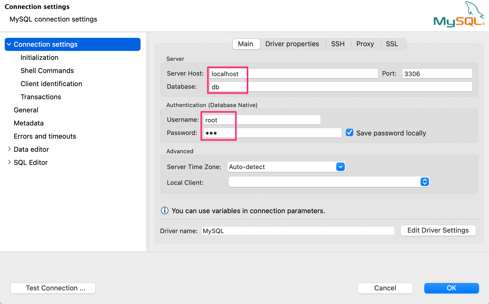

## Khởi tạo docker container với docker compose

```docker
version: "3.3"

volumes:
  data_db:

services:
  mysql:
    image: mysql:latest
    volumes:
      - data_db:/var/lib/mysql
    ports:
      - 3306:3306
    environment:
      MYSQL_PASSWORD: 123
      MYSQL_ROOT_PASSWORD: 123
      MYSQL_DATABASE: db
```

Chạy file docker-compose

```
docker-compose up -d
```

Hoặc sử dụng docker để khởi tạo container mysql

```docker
docker run -d --name db_mysql -p 3306:3306 \
-e MYSQL_PASSWORD=123 \
-e MYSQL_ROOT_PASSWORD=123 \
-e MYSQL_DATABASE=db \
mysql:latest
```

### Cấu hình trong DBeaver



Thông số cấu hình điền lấy trong file docker-compose hoặc câu lệnh khởi tạo container và điền vào các ô được khoanh đỏ

Trường hợp gặp lỗi tham khảo link sau: https://community.atlassian.com/t5/Confluence-questions/MySQL-Public-Key-Retrieval-is-not-allowed/qaq-p/778956

