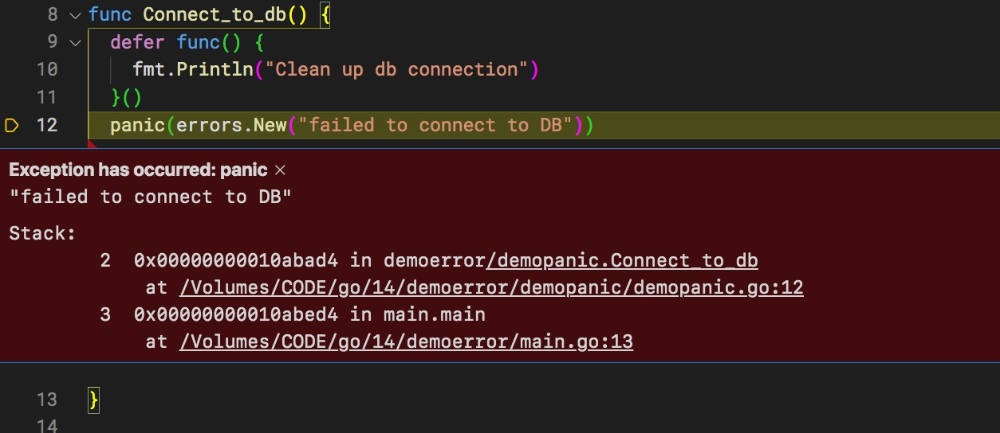

# Xử lý lỗi trong Golang

Các điểm yếu:
1. Không sử dụng try cach exception như Java, C++, C#
2. Không hiển thị được strack trace lỗi ở dòng nào. Rất khó debug
3. Trả về lỗi bằng `retun` nên cấu trúc kiểm tra lỗi khá dài dòng

```go
//cách 1: gán trực tiếp err trong câu lệnh if scope của nó chỉ trong lệnh if thôi
if err:= DB.connect(connect_string); err != nil {
	//Xử lý lỗi ở đây
}

//cách 2: có thể dùng lại biến err cho nhiều đoạn logic khác nhau trong 1 hàm
err :=  DB.connect(connect_string)
if err != nil {

}

err = DB.insert_data() //Tái sử dụng lại biến err vừa khai báo ở trên
if err != nil {

}

//cách 3: dùng err từ biến trả về
func Foo(connect_string string) (err error) {
	err =  DB.connect(connect_string)
	if err != nil {
		return //Chỉ cần lệnh return này, nhưng vẫn có thể trả về err
	}
}

```


Điểm cộng:
1. Có tính năng `defer` để thực hiện các thao tác ngay cả khi có lỗi phát sinh
2. Tốc độ xử lý và hỗ trợ tính đa nhiệm có thể chính là nguyên nhân các nhà thiết kế Go sử dụng phương pháp return error 
```go
func Bar() error {
	defer func() {  //hàm nay luôn chạy sau cùng trước bất kỳ lệnh return nào
		fmt.Println("Clean up resource at the end of Bar")
	}()
	return errors.New("Error from Bar function")
}
```
Pacnic hiển thị được stack nhưng hiển thị xong thì chương trình sập luôn.


Lời khuyên: đừng sợ khi phải dùng panic. Nếu thực sự cần dừng ứng dụng vì một lỗi nghiêm trọng. Tất nhiên nếu bạn có phương án recovery tốt như retry (thử lại vài lần) thì có thể hạn chế dùng panic.

Nếu bạn triển khai ứng dụng Golang app trong docker container. Nếu ứng dụng sập, thì thằng Docker Swarm sẽ tạo lại container mới.

Nhiệm vụ của lập trình viên là tìm nguyên nhân gây ra lỗi để xử lý tất. Cố gắng hạn chế tối đã những lỗi panic, hoặc crash mà không có phương án xử lý. Đừng nên dựa vào Docker Swarm khởi động lại container!

Phương Công Quân hỏi

Nếu panic đặt trong 1 routine thì nó sẽ dừng routine hay dừng cả ứng dụng ạ ?

Cường trả lời:
Tại thời điểm chạy panic, ứng dụng sẽ sập. Còn việc cho vào go routine hay để ở main routine chỉ giúp các lệnh khác có thể thực hiện song song thôi, chứ không giúp ứng dụng không bị sập khi xảy ra panic

