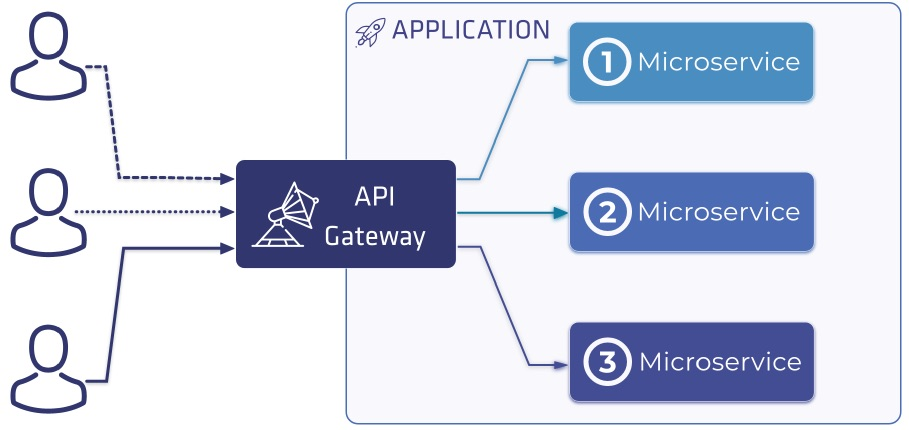
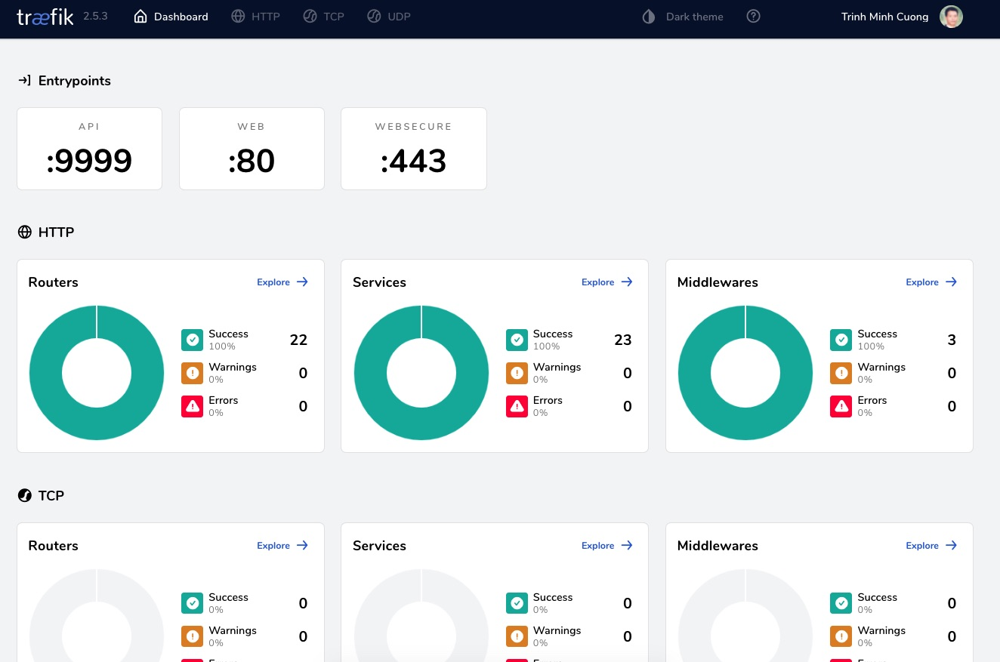
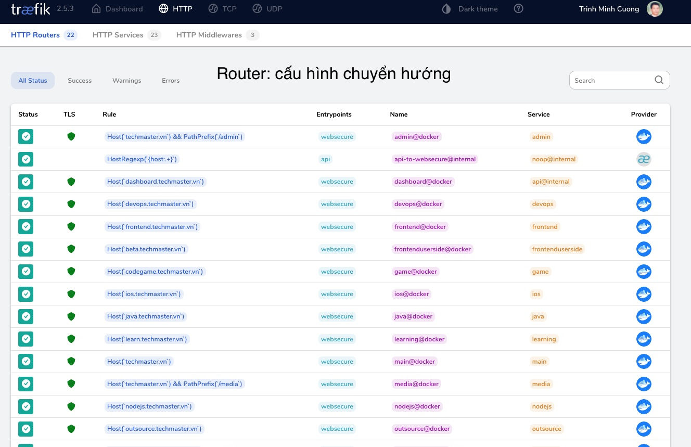
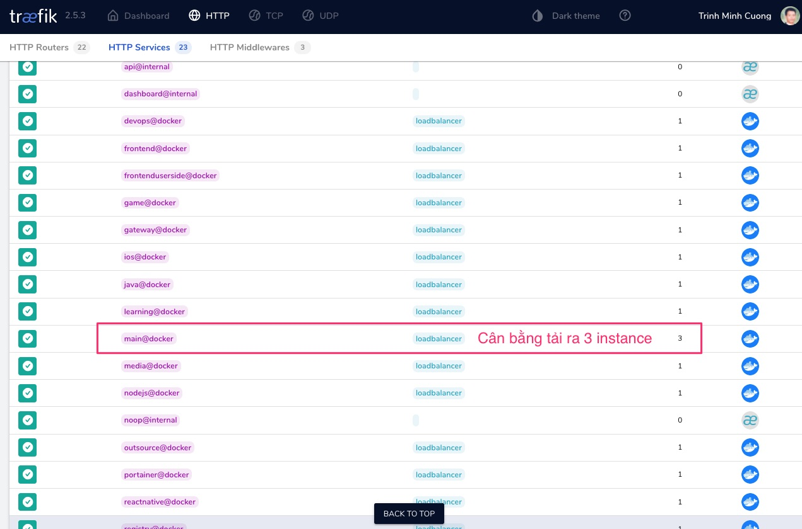

# API Gateway

## Giới thiệu

API Gateway là một phần mềm máy chủ làm nhiệm vụ điều hướng chuyển các request đến (incoming request) tới đúng các dịch vụ phía sau. API Gateway cũng tương đương như reverse proxy.

Chức năng chính của API Gateway hiện nay gồm có:
1. Điều hướng: route
2. Tự phát hiện dịch vụ: discover service
3. Cân bằng tải: load balancing
4. Giao diện quản trị: control dashboard
5. Viết, nạp thêm plugin
6. Viết, nạp thêm middleware. Middleware can thiệp incoming request, biến đổi nó trước điều hướng: Authentication, change header, rate limiter, circuit breaker, log...

## Những API Gateway phổ biến
1. HA-Proxy: viết hoàn toàn bằng C, C++. Rất chuyên làm Reverse Proxy. Chạy cực nhanh, tốn ít RAM, ổn định. Bản community rất ít chức năng, giao diện kém. Bản enterprize thu phí có đầy đủ giao diện quản trị, hỗ trợ Docker, Kubernetes
2. Nginx: viết hoàn toàn bằng C, C++, có hỗ trợ viết plugin bằng LUA.
Tốc độ tốt, dễ cấu hình. Bản community ít chức năng, không có giao diện điều khiển.
3. [Traefik](traefik.io): viết bằng Go. Tốc độ chỉ bằng 70% so với HA-Proxy, bộ nhớ tiêu thụ khi tải lớn gần gấp 2 so với HA-Proxy. Có thể viết thêm plugin cho Traefik 2.x sử dụng Go.
4. Kong: viết trên [OpenResty](https://openresty.org/en/) và ngôn ngữ lập trình LUA

Bên cạnh API Gateway còn có Service Mesh. Cách hoạt động của Service Mesh khác với API Gateway ở chỗ, Service Mesh route các lời gọi giữa service với nhau.

## Giới thiệu Traefik

Tại sao tôi chọn Traefik?
Trả lời: câu trả lời cũng tương tự như tại sao bạn chọn xe Yamaha mà không chọn Honda hay Suzuki. Traefik không phải là API Gateway có hiệu suất hoạt động tốt nhất. Nó xếp sau HAProxy và Nginx. Nhưng phiên bản miễn phí của Traefik dễ cấu hình, dễ quản trị nhất, phù hợp với các dự án nhỏ.

Giao diện quản trị thân thiện

Xem được tất cả cấu hình chuyển hướng

Tích hợp chặt chẽ với Docker và Docker Swarm để cân băng tải và tăng khả năng sẵn sàng: kết nối thông qua Docker socks để nhận biết thay đổi Docker container replica.

Phiên bản Traefik mới nhất tại tháng 10/2021 hỗ trợ:
- HTTP/3
- Private và Provider Plugins
- Load Balacing Health Check
- K8s Ingress 1.22+
- Router Metrics
- Consul Connect

## 